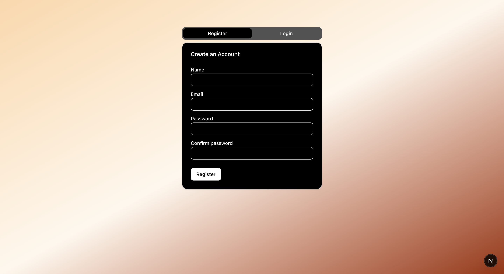
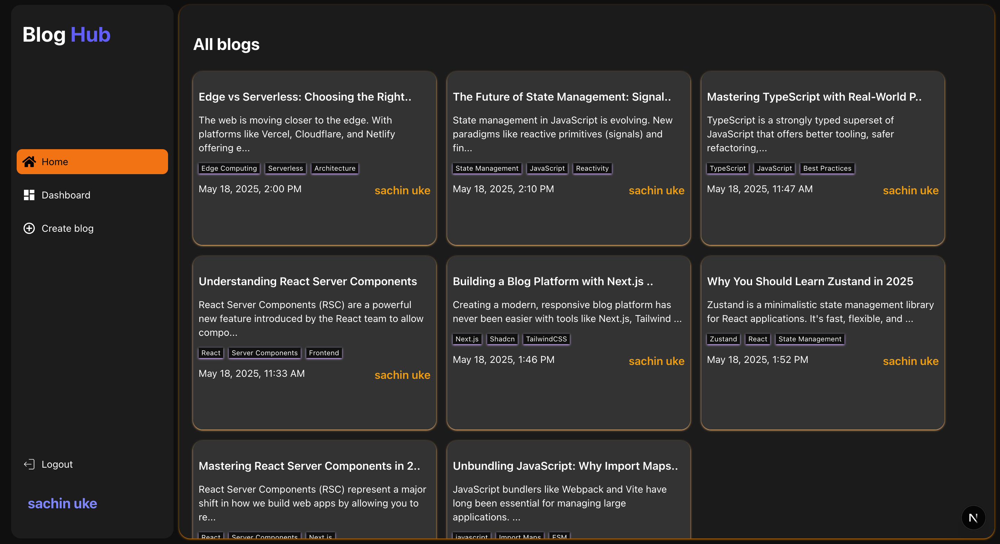
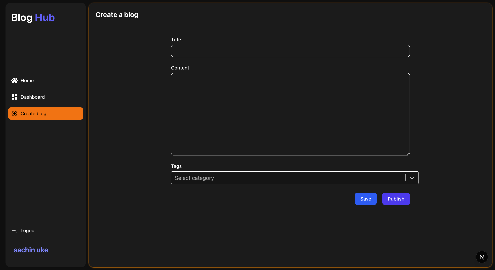
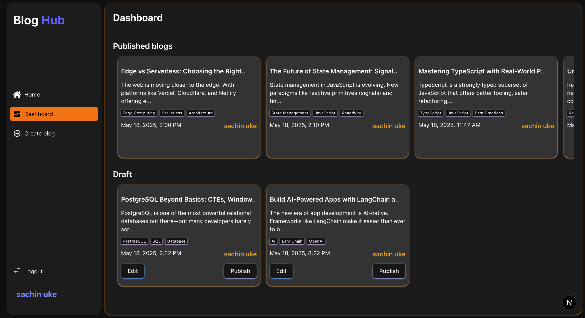
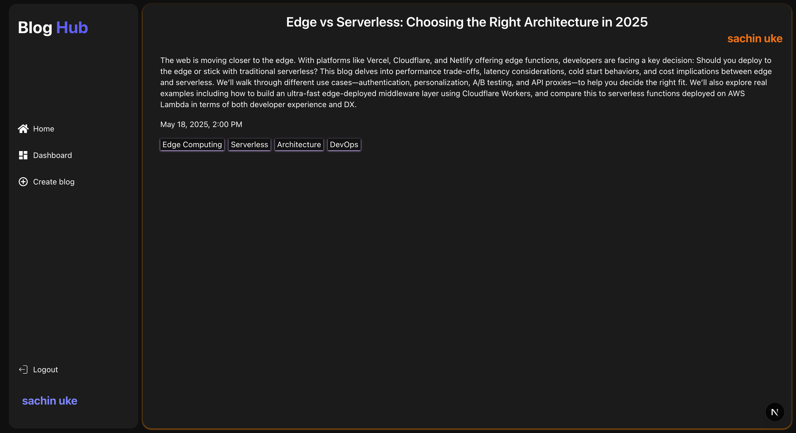

# 📝 Full Stack Blog Editor

A full-stack blog editor web app built with **Next.js**, **Express**, **PostgreSQL**, and **Prisma**. This app allows users to **write**, **auto-save drafts**, **publish**, and **manage** their blogs with a clean and responsive UI.

---

## 🚀 Features

- User Registration & Login (with JWT auth)
- Blog creation with:
  - ✍️ Title, Content, Tags
  - 💾 Save as Draft
  - 📤 Publish Blog
  - 🔁 Auto-save (after 5s of inactivity)
- ✏️ Edit and Update drafts/posts
- 🗃 View all blogs (grouped by Draft & Published)
- Protected API routes for blog operations
- Clean REST API and Prisma integration

---

## 🛠️ Tech Stack

### Frontend
- **Next.js** + **TypeScript**
- **Tailwind CSS** (via `shadcn/ui`)
- **React Hooks**
- **Lucide Icons**
- Toast Notifications (`sonner`)

### Backend
- **Express.js**
- **JWT Authentication**
- **Prisma ORM**
- **PostgreSQL (Neon Tech)**

---


## 🔐 Environment Variables

Create a `.env` file in the backend root with:

```env
DATABASE_URL=
JWT_SECRET=
```

---

## 🧪 API Endpoints

| Method | Endpoint                | Description                        |
|--------|-------------------------|------------------------------------|
| POST   | `/auth/login`           | Login with email & password        |
| POST   | `/auth/register`        | Register new user                  |
| POST   | `/auth/logout`          | Logout                             |
| GET    | `/auth/getuser`         | Get current user                   |
| POST   | `/blogs/save-draft`     | Save or update draft (🔐 protected)|
| POST   | `/blogs/update-blog`    | Update blog content (🔐 protected) |
| POST   | `/blogs/publish`        | Save and publish blog (🔐)         |
| POST   | `/blogs/publish-direct` | Create & publish immediately (🔐)  |
| GET    | `/blogs`                | Get all blogs                      |
| GET    | `/blogs/my`             | Get current user’s blogs (🔐)      |
| GET    | `/blogs/:id`            | Get blog by ID                     |

---

## 🧑‍💻 Setup Instructions

### 1. Clone the repository

```bash
git clone https://github.com/sachinuke36/blog.git
```

### 2. Install dependencies

#### For Backend:
```bash
cd server
npm install
npx prisma generate
npx prisma migrate dev --name init
```

#### For Frontend:
```bash
cd client
npm install
```

### 3. Run the development servers

#### Backend:
```bash
cd server
npm run dev
```

#### Frontend:
```bash
cd client
npm run dev
```

---

## ✅ Bonus Features

- ✅ Auto-save after 5 seconds of inactivity (debounced)
- ✅ Toast notifications for auto-save and status
- ✅ JWT-based route protection
- ✅ Responsive and accessible UI

---

## 📸 Screenshots

### 🔐 Login Page


## 🏠 Home Page


### 📝 Create Blog


### 📊 Dashboard


### 📝 Blog details


---

## 📬 Contact

Have questions or feedback? Reach out at **sachinuke36@gmail.com**.
